# Capstone Project: MyFitTracker

## About MyFitTracker
MyFitTracker is a web-based application that allows users to track their fitness activities, monitor progress, and set fitness goals.
## Why use MyFitTracker?
There are many wearable devices and fitness applications available today. However, most applications tend to be incomaptible across different operating systems or products. This makes it difficult to work out with friends or family, as you cannot encourage or compete with people using different environments. This is where MyFitTracker comes into play. With this web-based application, you can communicate with your friends and family, no matter what environment they are using.

## Features
- Login/Signup
    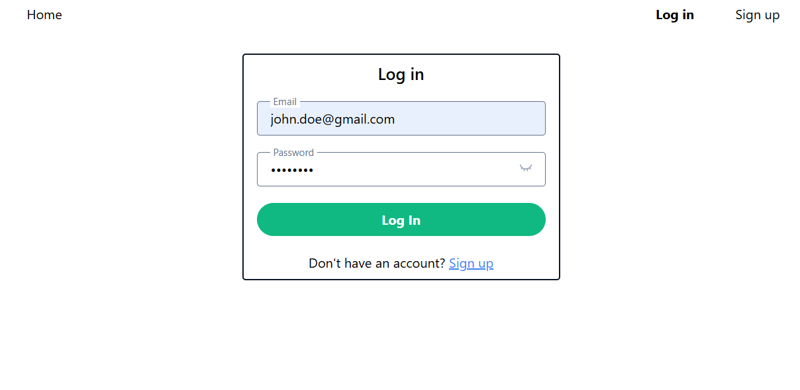
    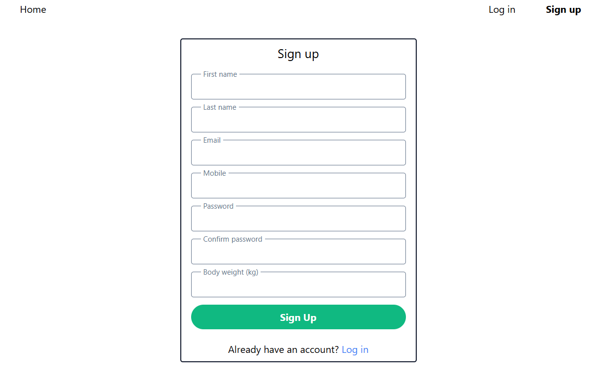
- Goal
    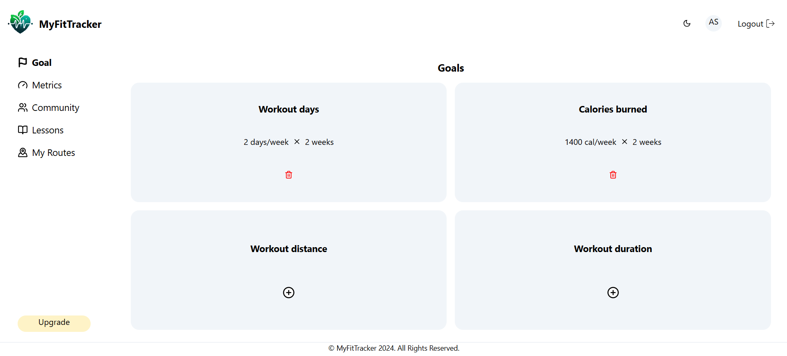
    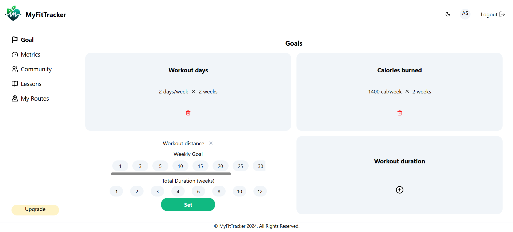
- Metrics
    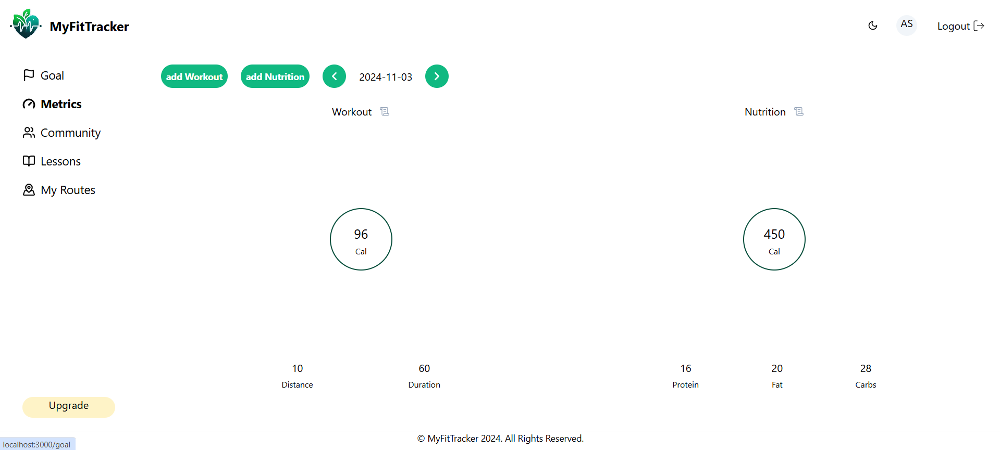
    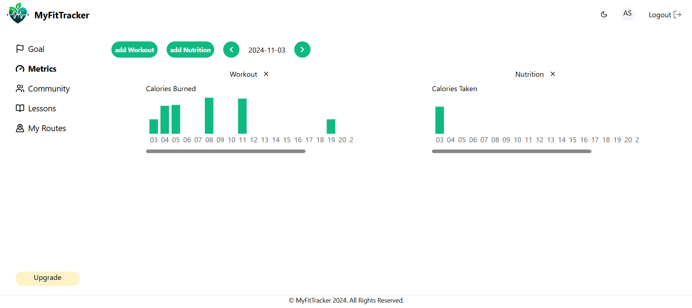
- User Authentication by User Type
    - Only for Premium Users
    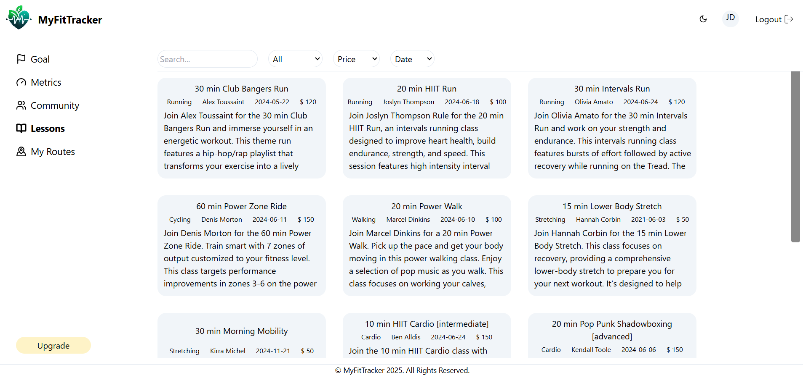
    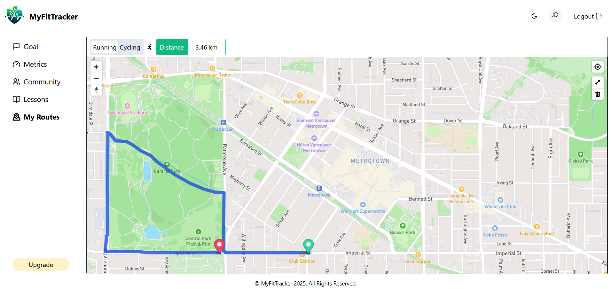
    - Without Permission
    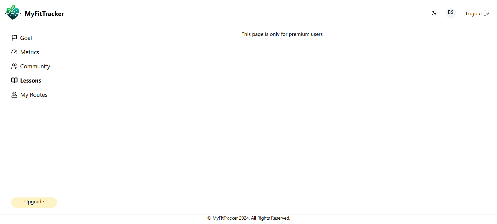
- Mobile Layout
    - Goal
        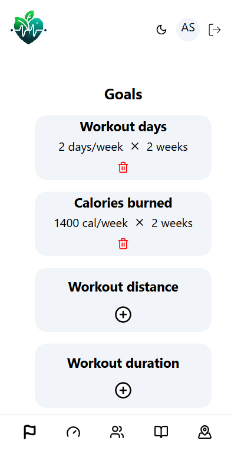
    - Metrics
        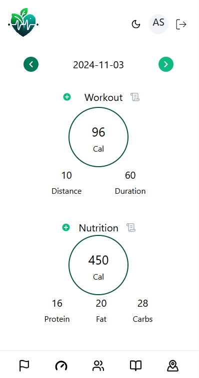
        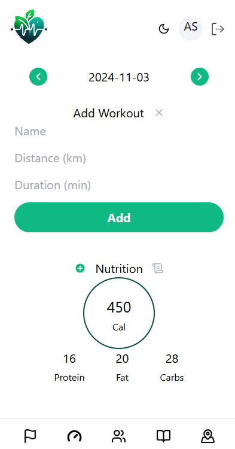
        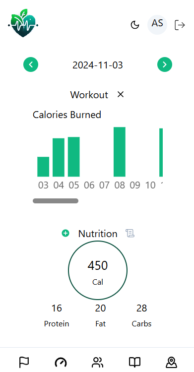
    - Lessons

        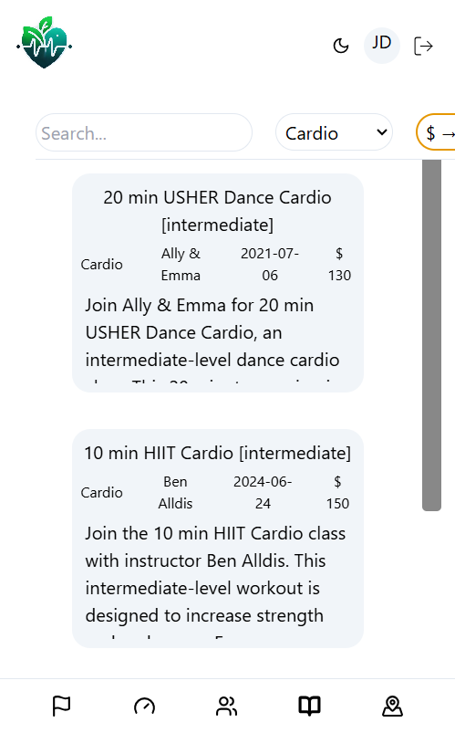
    - My Routes

        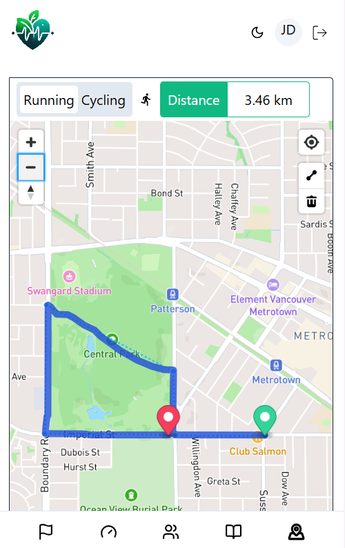

## Technology Stack
- Frontend: 
    - React.js for interactive user interface
    - Tailwind CSS for responsive design
    - Axios for making requests to the backend 
- Backend:
    - Node.js with Express.js for handling API requests
    - RESTful APIs
- Database:
    - PostgreSQL
- Authentication & Security:
    - JWT (JSON Web Tokens) for user authentication
    - bcrypt
- 

## Features to be implemented
- User Authentication
    - Register/login to save fitness data
    - Multiple User Roles: regular and premium
- Activity Logging
    - Log workout activities (e.g., running, cycling, swimming) with duration, distance, calories burned.
- Goal Setting
    - Set fitness goals (e.g., run 20 km in a month)
    - Track goal progress over time.
- Progress Dashboard
    - View workout history, weekly/monthly summaries
    - Visual representation of goals vs. actual performance (graphs, charts)
- Nutrition Tracking
    - Log daily food intake and calories consumed
    - Track macros (protein, carbs, fats)

## User stories:
- Log Workout: Users log into their dashboard, click "Add Workout," select the workout type, enter data (duration, distance), and click "Save."
- Track Progress: On the dashboard, users view their progress toward fitness goals through weekly summaries and graphs.
- Set a Goal: Users set a goal (e.g., run 20 km per month) and track progress through visual indicators

## References:
### Backend:
- How to hash password
    - https://stackoverflow.com/questions/34120548/using-bcrypt-with-sequelize-model
- How to implement JWT
    - https://blog.logrocket.com/how-to-implement-jwt-authentication-vue-nodejs/
    - https://medium.com/@aman.ahmed1897/authentication-in-node-js-using-jwt-3982863458da
- Cals calculation
    - https://www.calculator.net/calories-burned-calculator.html
    - https://blog.nasm.org/metabolic-equivalents-for-weight-loss#:~:text=So%20now%20that%20we%20understand,%2F%20200%20%3D%20KCAL%2FMIN.&text=So%20in%2045%20minutes%2C%20this,700%20calories%20running%20at%207mph.
- JWT Authentication in React with react-router
    - https://dev.to/sanjayttg/jwt-authentication-in-react-with-react-router-1d03
