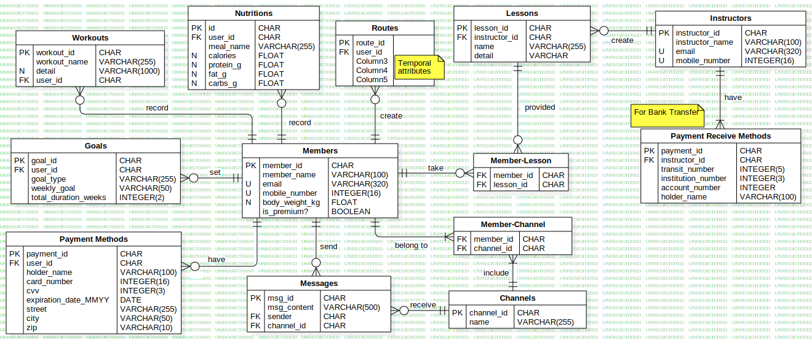

# Capstone Project: MyFitTracker

## About MyFitTracker
MyFitTracker is a web-based application that allows users to track their fitness activities, monitor progress, and set fitness goals.
## Why use MyFitTracker?
There are many wearable devices and fitness applications available today. However, most applications tend to be incomaptible across different operating systems or products. This makes it difficult to work out with friends or family, as you cannot encourage or compete with people using different environments. This is where MyFitTracker comes into play. With this web-based application, you can communicate with your friends and family, no matter what environment they are using.

## Technology Stack
- Frontend: 
    - React.js for interactive user interface
    - Tailwind CSS for responsive design
    - Axios for making requests to the backend 
- Backend:
    - Node.js with Express.js for handling API requests
    - RESTful APIs
- Database:
    - PostgreSQL
- Authentication & Security:
    - JWT (JSON Web Tokens) for user authentication
    - bcrypt
- Deployment:
    - AWS (or Render? or Vercel?) for deployment
    - Cloudinary or Amazon S3 for hosting images of property listings
- Optional Services:
    - ElasticSearch for more advanced search capabilities (geo-based, full-text)
    - Stripe or PayPal for payment integration (in case of paid plans)

## Features to be implemented
- User Authentication
    - Register/login to save fitness data
    - Optional guest mode for quick tracking
    - (For instructors) Register/login to upload lessons
- Activity Logging
    - Log workout activities (e.g., running, cycling, weightlifting) with duration, distance, calories burned.
    - (Optional) Integrate with third-party APIs (e.g., Fitbit, Strava)
- Goal Setting
    - Set fitness goals (e.g., run 20 km in a month)
    - Track goal progress over time.
- Progress Dashboard
    - View workout history, weekly/monthly summaries
    - Visual representation of goals vs. actual performance (graphs, charts)
- Nutrition Tracking
    - Log daily food intake and calories consumed
    - Track macros (protein, carbs, fats)
- Community Features
    - Join fitness groups and share workout progress
    - Challenge friends to fitness competitions
- Dark Mode
    - Switch between light and dark modes for accessibility
- (Optional) Advanced Features:
    - Create Custom Routes: Allow paid users to create their own walking or running routes with Mapbox API (paid plan)
    - Notifications & Alerts: Allow users to set daily targets, receive reminders via alerts, and get notified of messages from friends and instructors
    - Multiple User Roles: In addition to regular users, introduce an instructor role that can give lessons, receive reviews from users, and earn money through paid classes

## User stories:
- Log Workout: Users log into their dashboard, click "Add Workout," select the workout type, enter data (duration, distance), and click "Save."
- Track Progress: On the dashboard, users view their progress toward fitness goals through weekly summaries and graphs.
- Set a Goal: Users set a goal (e.g., run 20 km per month) and track progress through visual indicators
- Community Engagement: Users join fitness groups to share progress and participate in challenges
- (Optional)
    - Add Payment Method: Users log into their dashboard, click "Add Payment Method," enter data, and click "Save."
    - Customize Own Routes: Paid users navigate to "My Routes" and customize their own routes, and click "Save."
    - Take Lessons: Paid users navigate to "Lessons" page and select lessons (e.g., exercise lesson, nutrition lecture)
    - For Instructors
        - Register Lessons: Instructors log into their dashboard, click "Add Lesson", select the lesson type (e.g., workout, nutrition) and set the price, upload the lesson, and click "Save."
        - Add Payment Method: Instructors log into their dashboard, click "Add Payment Method" to receive money they earn, enter necessary details, and click "Save."

## Use Case Diagram

## Entity Relationship Diagram

## UI Wireframe

## References:
### Backend:
- How to hash password
    - https://stackoverflow.com/questions/34120548/using-bcrypt-with-sequelize-model
- How to implement JWT
    - https://blog.logrocket.com/how-to-implement-jwt-authentication-vue-nodejs/
    - https://medium.com/@aman.ahmed1897/authentication-in-node-js-using-jwt-3982863458da
